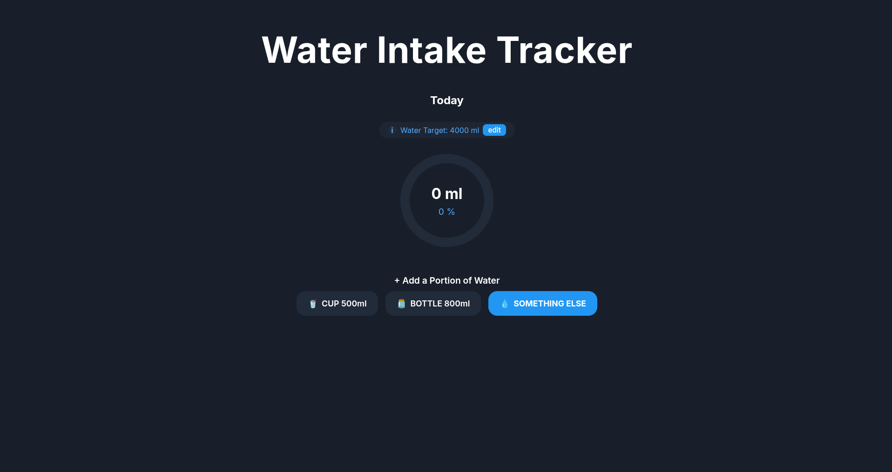
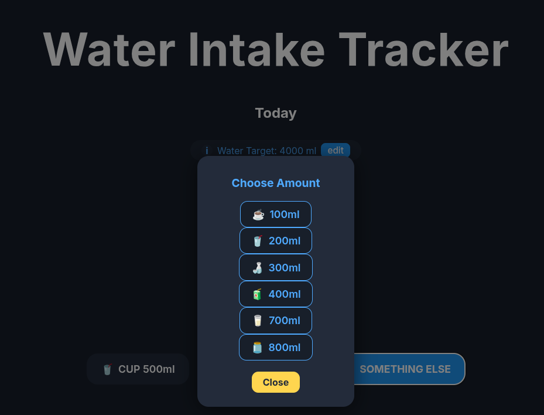

# 💧 Water Intake Tracker

A modern and elegant web application to track your daily water intake with real-time progress visualization and persistent data storage.

<p align="center">
  
</p>

## 📸 Screenshots

### Main Interface

*Clean and intuitive interface with circular progress indicator and quick-add buttons*

### Goal Celebration

*Animated celebration with confetti when you reach your daily water intake goal*

### Custom Amounts

*Flexible portion selection with various container types and custom amounts*

## 🌟 Features

- **💧 Smart Water Tracking**: Log water intake with predefined portions (500ml cup, 800ml bottle) or custom amounts
- **📊 Real-time Progress**: Beautiful circular progress indicator showing your daily intake percentage
- **🎯 Customizable Goals**: Set and edit your daily water intake target (default: 2000ml)
- **🎉 Goal Celebrations**: Animated celebration with confetti when you reach your daily goal
- **⏰ Automatic Reset**: Daily progress resets automatically at midnight
- **💾 Persistent Storage**: All data is saved to PostgreSQL database with localStorage fallback
- **📱 Responsive Design**: Modern dark theme interface that works on all devices

## 🚀 Quick Start

### Prerequisites
- **For Local Development**: Node.js 18+ and npm
- **For Obsidian Integration**: Docker and Docker Compose

### Running the Application

#### Option 1: Local Development (npm)
```bash
# Clone this repository
git clone https://github.com/abner-dos-reis/water-intake-tracker.git
cd water-intake-tracker

# Install dependencies
npm install

# Start the application
npm run dev
```

Access: http://localhost:5173

#### Option 2: Docker (For Obsidian Integration)
```bash
# Clone this repository
git clone https://github.com/abner-dos-reis/water-intake-tracker.git
cd water-intake-tracker

# Start with Docker
docker compose up --build -d
```

Access: 
- **Web App**: http://localhost:5173
- **API**: http://localhost:4000

### 🤔 Why Docker?

The main purpose of using **Docker** in this project is to enable **direct integration with Obsidian** through the **Web Browser Viewer** (and also **[Custom Frames](https://obsidian.md/plugins?id=obsidian-custom-frames)** plugin).

With Docker, the app runs as a local web service, which allows:

- **Seamless Obsidian integration**: The tracker opens inside Obsidian as if it were part of the note, without relying on external services.  
- **Isolated and standardized environment**: Prevents dependency conflicts on your system.  
- **Easy access**: Runs on **localhost** by default, but can also be opened on your home network or restricted to specific IPs.  
- **Always available**: The container ensures the app runs continuously without manual startup each time.  

👉 In short: **Docker makes it possible to use this app as a water intake tracker fully integrated with Obsidian**, accessible via the **Web Browser Viewer** + **Custom Frames** plugin and ready to use across multiple devices.


### 🌐 Network Configuration

**Default (Localhost Only)**:
```yaml
ports:
  - "127.0.0.1:5173:5173"  # Only accessible from this computer
```

**Open to Network** (edit `docker-compose.yml`):
```yaml
ports:
  - "0.0.0.0:5173:5173"    # Accessible from any device on network
```

**Restrict to Specific IPs**:
```yaml
ports:
  - "192.168.1.100:5173:5173"  # Only accessible from specific IP
```

## 🏗️ Architecture

The application follows a modern three-tier architecture:

┌─────────────────┐ ┌─────────────────┐ ┌─────────────────┐
│ React Frontend │ │ Express Backend│ │ PostgreSQL DB │
│ (Port 5173) │◄──►│ (Port 4000) │◄──►│ (Port 5432) │
└─────────────────┘ └─────────────────┘ └─────────────────┘

### Frontend (React + Vite)
- Modern React 19 with hooks
- Vite for fast development and building
- CSS3 animations and responsive design
- Progressive enhancement with localStorage fallback

### Backend (Node.js + Express)
- RESTful API with Express.js
- CORS enabled for cross-origin requests
- Input validation and error handling
- Database connection pooling

### Database (PostgreSQL)
- Structured data storage with relationships
- Tables: `water_intake`, `user_settings`, `daily_celebrations`
- ACID compliance for data integrity

## 🛠️ Technology Stack

- **Frontend**: React 19, Vite, CSS3
- **Backend**: Node.js, Express.js
- **Database**: PostgreSQL 15
- **DevOps**: Docker, Docker Compose
- **UI/UX**: Custom CSS with animations, responsive design

## 🤝 Contributing

1. Fork the repository
2. Create a feature branch (`git checkout -b feature/amazing-feature`)
3. Commit your changes (`git commit -m 'Add amazing feature'`)
4. Push to the branch (`git push origin feature/amazing-feature`)
5. Open a Pull Request

## 📄 License

This project is licensed under the MIT License - see the [LICENSE](LICENSE) file for details.

---

**Stay hydrated! 💧** Made with ❤️ for better health habits.
